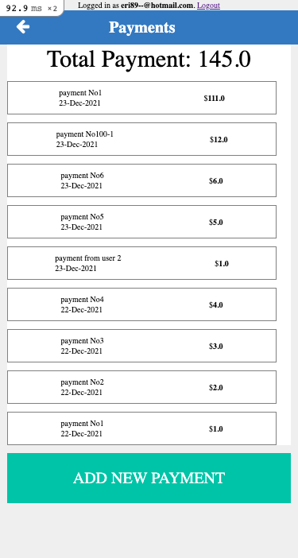
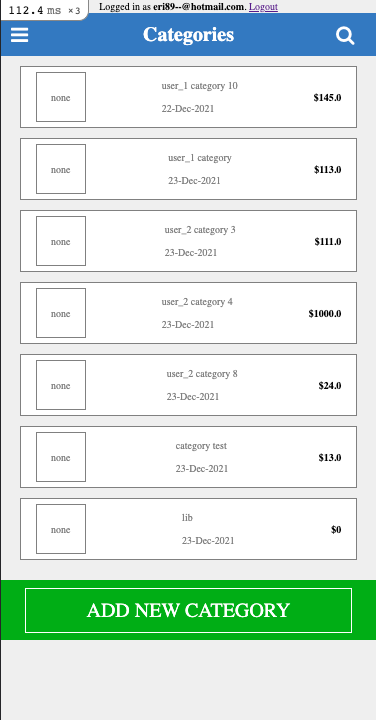

# Budget App

> With this project we are able to add many categories and their respective payments.





Freely add new categories and payments after login.

## Built With

- Ruby
- Rails
- HTML & CSS

## Live Demo

[Live Demo Link](https://morning-journey-90954.herokuapp.com/)


## Getting Started

To get a local copy up and running follow these simple example steps.

### Prerequisites

Have installed Ruby and Rails in your machine

### Setup

clone this repo with:
``` ruby 
git clone https://github.com/eri8-9/budget_app
```

### Install

``` ruby
run `bundle install`
run `npm install or yarn install`
```

### Run tests

``` ruby
run `rspec spec`
```

If you wanna run a certain test file
```ruby
rspec spec/test_file_path
```

## Authors

👤 ** Christian Erick **

- GitHub: [@githubhandle](https://github.com/githubhandle)
- Twitter: [@twitterhandle](https://twitter.com/twitterhandle)
- LinkedIn: [LinkedIn](https://linkedin.com/in/linkedinhandle)

## 🤝 Contributing

Contributions, issues, and feature requests are welcome!

Feel free to check the [issues page](https://github.com/eri8-9/budget_app/issues).

## Show your support

Give a ⭐️ if you like this project!

## Acknowledgments

- [Microverse](https://www.microverse.org/)
- [SnapScan Design Guideline](https://www.behance.net/gallery/19759151/Snapscan-iOs-design-and-branding?tracking_source=)

## 📝 License

This project is [MIT](./MIT.md) licensed.